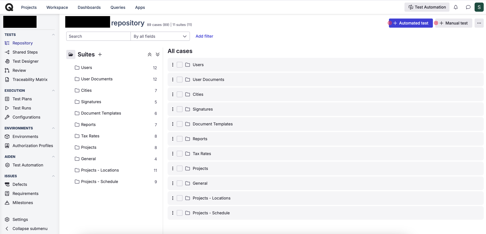
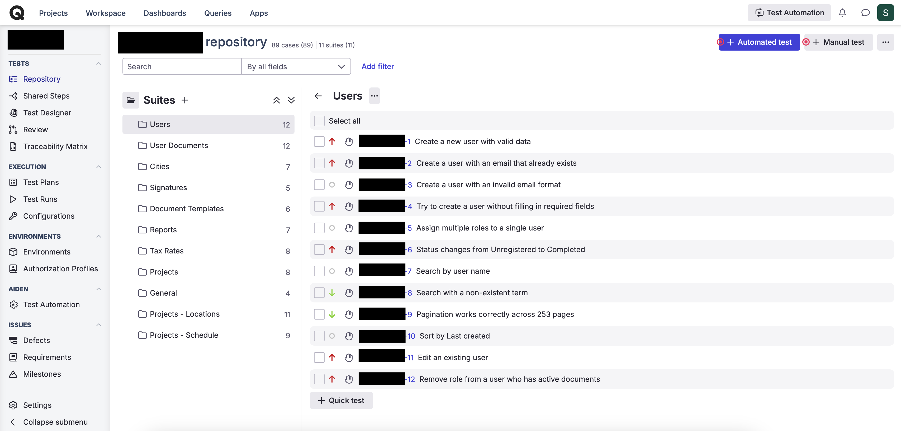
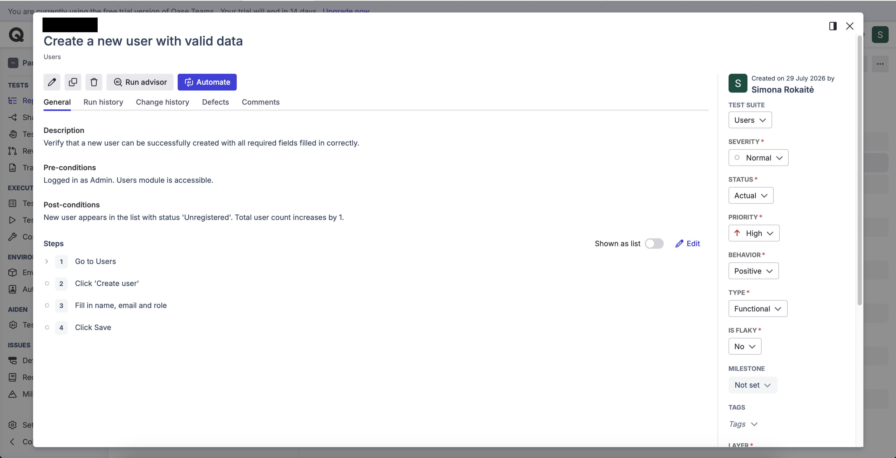

# Test Cases
Manual test cases written during QA internship on commercial 
web applications. Managed in Qase.

---

## Project 1 — Document Management Platform

Internal Lithuanian staffing document management system.
Test cases written based on system analysis prior to 
formal requirements documentation being available.

**File:** Test_Cases_-_Document_Management_Platform.xlsx  
**Tool:** Qase (exported)  
**Total test cases:** 91  
**Modules covered:** 11  

### Modules and coverage

| Module | Test cases |
|---|---|
| Users | 12 |
| User Documents | 12 |
| Cities | 7 |
| Signatures | 5 |
| Document Templates | 6 |
| Reports | 7 |
| Tax Rates | 8 |
| Projects | 8 |
| General | 4 |
| Projects — Locations | 11 |
| Projects — Schedule | 9 |
| **Total** | **89** |

### Priority breakdown

| Priority | Count |
|---|---|
| High | 36 |
| Medium | 38 |
| Low | 15 |

### Test types used

- Functional — positive, negative and boundary scenarios
- Data integrity — cross-module impact of changes
- Access control — role-based restrictions (Admin vs Performer vs Assistant)
- Exploratory — unscripted investigation of Schedule and Locations modules

---

## Tools used

Qase · Jira · Azure DevOps · Manual testing · Exploratory testing

## Screenshots

**All suites — 11 modules, 89 test cases**

**Users module — 12 test cases with priority indicators**

**Individual test case — showing description, 
pre-conditions, post-conditions, steps and attributes**

